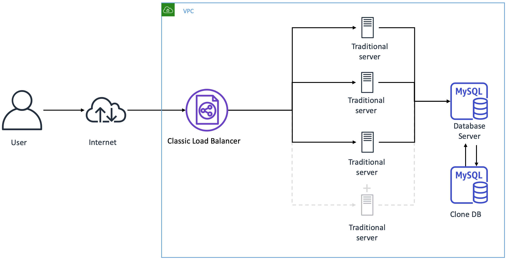
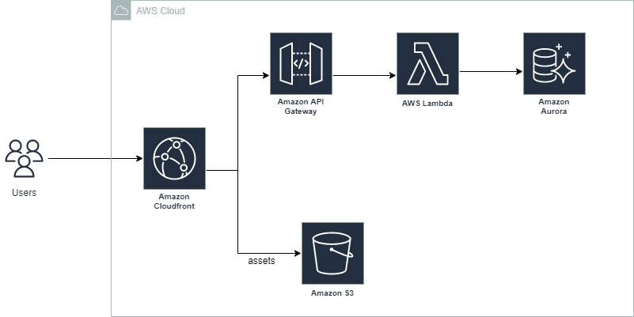

# Scalability with traditional Web applications

Scalability is an inherent challenge with the traditional LAMP stack. 

A scalable application is one that can handle highly variable levels of traffic. PHP applications are often scaled horizontally, by adding more web servers as needed.  
This is managed via a load balancer, which directs requests to various web servers. 
* For each additional server we have to manage networking, administration, storage, security and software updates
* Also, each horizontally scaled server runs independently. So we need something like ECS or Kubernetes to manage the synchronization between these servers

A traditional web application can be split into three components:
* The static assets (media files, css, js)
* The dynamic application, ie Server Side Scripting (PHP or Perl or Python)
* Database (MySQL)

# Serverless Approach

A serverless approach to serving these two components is illustrated below:

This consists of the following components
* The static assets (media files, css, js, htm) are stored on a **private S3 bucket**
* The backend requests are routed to the **API Gateway** and further into **AWS Lambda functions**
* The Database used is **AWS Aurora** (which can be **scaled globally**)
* **AWS Cloudfront** is uses to securely serve and cache static assets from the S3 bucket and also route the dynamic requests to the API gateway

The advantages of the above approach are
1. Cost
2. Scalability
3. Reliable
4. Secure

Lets see how to configure the various services

### S3 

To serve a static website hosted on Amazon S3, you can deploy a CloudFront distribution using one of these configurations:
* **Using a REST API endpoint as the origin, with access restricted by an origin access identity (OAI)**
* Using a website endpoint as the origin, with access restricted by a Referer header
* Using a website endpoint as the origin, with anonymous (public) access allowed (Not recommended)

The advantage of using REST API endpoint is that the S3 bucket need not be public and **all access is over HTTPS**.
The configuration is as simple as
1. Create a CloudFront web distribution. In addition to the distribution settings that you need for your use case, enter the following:
* For **Origin domain**, select the bucket that you created.
* For **S3 bucket access**, select **Yes use OAI (bucket can restrict access to only CloudFront)**.
* For **Origin access identity**, select **Create new OAI**. Then, enter the OAI name and choose **Create**.
* For **Bucket policy**, select **Yes, update the bucket policy**.
2. Update the **DNS records for your domain to point your website's CNAME to your CloudFront distribution's domain name**. You can find your distribution's domain name in the CloudFront console in a format that's similar to d1234abcd.cloudfront.net.

### Lambda

AWS Lambda supports **Custom Runtime API** which enables Lambda function execution is any programming language. 
While lambda, as of now, does not support PHP natively, we have PHP frameworks like [Laravel](https://laravel.com/) and [Symfony](https://symfony.com/) which can be configured as custom RuntimeAPI for lambda

### API Gateway

REST APIs and HTTP APIs are both RESTful API products. REST APIs support more features than HTTP APIs, while HTTP APIs are designed with minimal features so that they can be offered at a lower price. For more information, see Choosing between REST APIs and HTTP APIs.  
You can use HTTP APIs to send requests to AWS Lambda functions or to any routable HTTP endpoint. For example, you can create an HTTP API that integrates with a Lambda function on the backend. When a client calls your API, API Gateway sends the request to the Lambda function and returns the function's response to the client.

API gateway also provides an API endpoint that we can use to access our backend APIs. However, it would be weird to use the API gateway domain from within our static webpages (hosted on s3) to route requests.  
We can however configure the Cloudfront domain to access the web app and the API. While we dont get any advantages like caching () 

The configuration again is simple as
1. Create a CloudFront web distribution. In addition to the distribution settings that you need for your use case, enter the following:
* For **Origin domain**, select your  API Gateway invoke URL
* In the **Cache policy** options, choose the **CachingDisabled** option. We are disabling the cache to not cache the API response otherwise when you will deploy a new change to your API, then CloudFront will still return the previous cached result.

Now, cloudfront will redirect all the requests, which include /api/ in the URL to the API gateway

### AWS Aurora

Aurora provides high performance and availability for MySQL and PostgreSQL databases. The underlying storage scales automatically to meet demand, up to 64 tebibytes (TiB).   
An Amazon Aurora DB instance is created inside a **virtual private cloud (VPC) to prevent public access**. To connect to the Aurora database instance from a Lambda function, that Lambda function must be configured to access the same VPC.

#### RDS Proxy 
AWS RDS Proxy (available since November 2019), is a fully **managed database proxy** feature for AWS RDS. It establishes a database connection pool which sits between your application and database and reuses connections in this pool.   
. This protects the database against over-subscription, without the memory and CPU overhead of opening a new database connection each time. Credentials for the database connection are securely stored in AWS Secrets Manager. They are accessed via an AWS Identity and Access Management (IAM) role. This enforces strong authentication requirements for database applications without a costly migration effort for the DB instances themselves.

# Serving Paid Content, Documents, Media Stream over S3

A lot of companies want to distribute content like Document, Media Streams over the internet, but restrict access to selected users, eg. paying customers in Netflix/Prime Videos like situation.

To serve this content, we can use **CloudFront signed URLs or signed cookies**. It a then a good practise to restrict access to content directly eg AWS S3 url.

You then develop your application either to create and distribute signed URLs to authenticated users or to send Set-Cookie headers that set signed cookies for authenticated users.

It is then a good practise to **Restrict access to files in Amazon S3 buckets**
This prevents someone from bypassing CloudFront and using the Amazon S3 URL to get content that you want to restrict access to.

To require that users access your content through CloudFront URLs, you need to :
* Give a CloudFront origin access control permission to read the files in the S3 bucket.
* Create the origin access control and associate it with your CloudFront distribution.
* Remove permission for anyone else to use Amazon S3 URLs to read the files.

